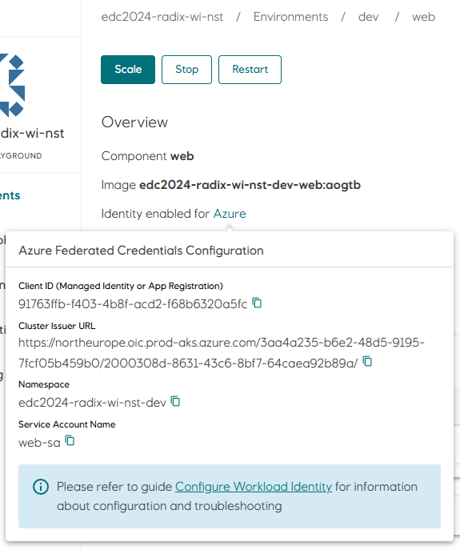
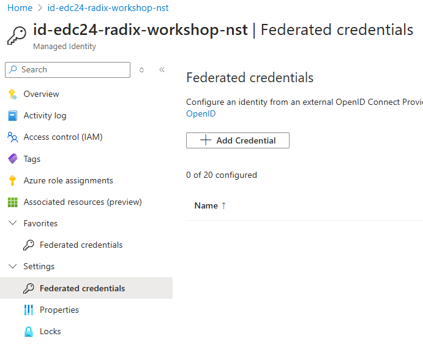
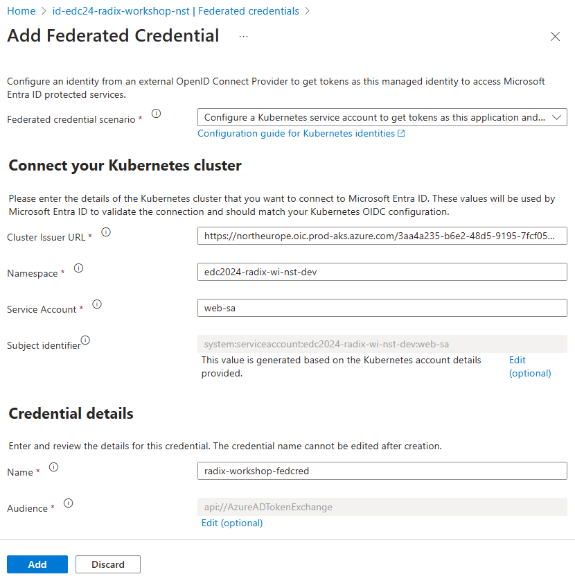

# Configure Workload Identity

Follow these steps to configure workload identity for your application. This prepares the required infrastructure (managed identity, radixconfig.yaml and federated credentials). We will later modify the code to use workload identity to acquired Azure AD access tokens.


## 1. Create a managed identity in Azure:

- Open a terminal in VS Code (`Terminal -> New Terminal`).
- Type `az login` and press `<Enter>`. If you are using GitGub Codespaces in a browser you should run `az login --use-device-code` instead.  
  Your web browser will open and ask you to select which account you want to login with.  
  If the login command prints a list of subscriptions and asks you to select one, just press `<Enter>` to go with the default selection.
- Run the following command in the terminal to create a managed identity:
  ```
  az identity create --subscription d1775405-6d42-4fba-99ac-3cae223d9087 \
  --resource-group radix-workshop-24 \
  --name id-edc24-radix-workshop-$(az ad signed-in-user show -otsv --query mail | awk -F"@" '{print tolower($1)}') \
  --query clientId -otsv
  ```
  The command will print the `clientId` which we will use to configure workload identity.

## 2. Configure workload identity for the `web` component

- Open `radixconfig.yaml` and uncomment the `identity` section for the `web` component (replace `<clientId>` with value from previous step):
  ```yaml
  components:
    - name: web
      identity:
        azure:
          clientId: <clientId>
  ```
- Commit and push changes to trigger a new build-deploy job for your Radix application. Wait for the job to finish before proceeding.

## 3. Configure federated credentials for the managed identity

- Open your application's `web` component in Radix Web Console (`Environments -> dev -> web`).
- Click the `Azure` link to show the values needed to register the federated credentials for the managed identity.  

- Replace the brackets (`<>`) in the command below with these values and run it in the VS Code terminal.
  ```
  az identity federated-credential create --subscription d1775405-6d42-4fba-99ac-3cae223d9087 \
  --resource-group radix-workshop-24 \
  --output none \
  --issuer <Cluster Issuer URL> \
  --audiences api://AzureADTokenExchange \
  --subject system:serviceaccount:<Namespace>:<Service Account Name> \
  --identity-name id-edc24-radix-workshop-$(az ad signed-in-user show -otsv --query mail | awk -F"@" '{print tolower($1)}') \
  --name radix-workshop-fedcred
  ```

<br/>

This completes the configuration of the trust relationship between the `web` component in the `dev` environment, and the Azure managed identity. Our component should now be able to acquire access tokens using the [OAuth2 Client Credentials Flow with assertion](https://learn.microsoft.com/en-us/azure/active-directory/develop/v2-oauth2-client-creds-grant-flow#third-case-access-token-request-with-a-federated-credential) to access protected Azure resources.

</br>

---

</br>

You can also use the Azure web portal to create the managed identity and register federated credentials.
Create managed identity: Open the [radix-workshop-24](https://portal.azure.com/#@StatoilSRM.onmicrosoft.com/resource/subscriptions/d1775405-6d42-4fba-99ac-3cae223d9087/resourcegroups/radix-workshop-24/overview) resource group, click `Create` and search for `user assigned managed identity`.

Register federated credentials: open the managed identity, click `Federated credentials` in the left menu and then `Add credentials`.  


Select `Kubernetes accessing Azure resources` in the drop down and fill out the form with values found in Radix Web Console.  


---

[[Home]](../readme.md)  
[[Previous]](configure_radix_application.md) [[Next]](configure-azure-sql.md)