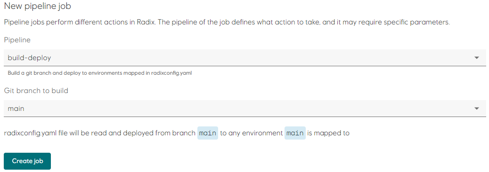

# Configure application in Radix Playground

Follow these steps to register your application in [Radix Playground](https://console.playground.radix.equinor.com/applications):

## 1. Register application in Radix

- Open `radixconfig.yaml` and replace the `<Equinor User Name>` placeholder in `metadata.name` with your user name.   
Example:
  ```yaml
  apiVersion: radix.equinor.com/v1
  kind: RadixApplication
  metadata:
    name: edc2024-radix-wi-nst
  ```
- Commit and push changes to GitHub.
- Open [Radix Playground](https://console.playground.radix.equinor.com/) and click `Create new app`.
- Fill in the registration form:
  - `Name`: must match the value of `metadata.name` in `radixconfig`.
  - `GitHub repository`: Use the HTTP URL to your repository.
  - `Config branch`: set it to `main`.
  - `Administrators`: Can be empty in Playground, but is mandatory in Platform clusters  

- Click `Create new app` and follow the instructions to add `Deploy key` and `Webhook`.
- Registration is complete, and you can go to your application by clicking on the `your application page` at the bottom of the form.

## 2. Trigger initial `build-deploy` job

- Click `Pipeline Jobs` in the left side navigation bar.
- Click `Create new`.
- Open the `Git branch to build` drop-down and select `main`.
- Click `Create job`.  

- Click `Pipeline Job` to view the progress of the build-deploy job.
- Wait for the job to complete, and the navigate to the `Environments` page. Confirm that the application is working by clicking the `web` link.  


---

---

[[Home]](../readme.md)  
[[Previous]](create_repository.md) [[Next]](configure-workload-identity.md)