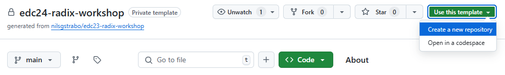
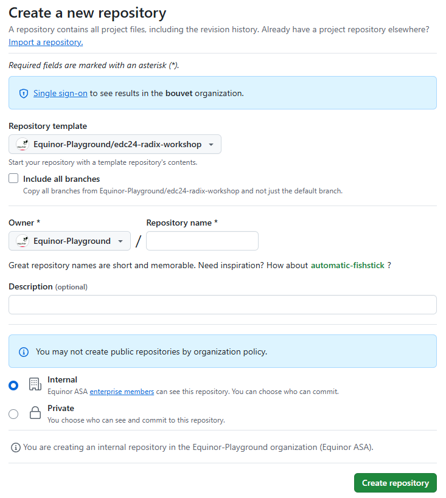
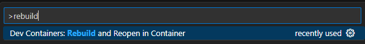
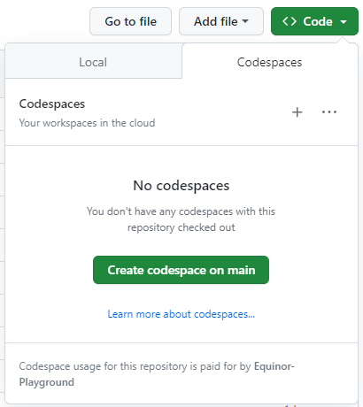
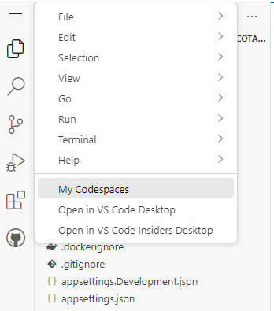
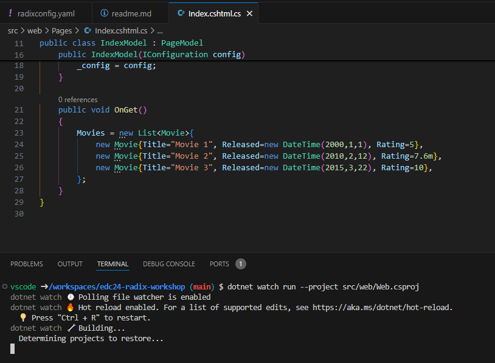

# Configure GitHub reposistory

Follow these steps to create a new GitHub repository using [edc24-radix-workshop](https://github.com/Equinor-Playground/edc24-radix-workshop) as template.

- Open [https://github.com/Equinor-Playground/edc24-radix-workshop](https://github.com/Equinor-Playground/edc24-radix-workshop) and click `Use this template` -> `Create a new repository`.  
  
- Give the repository a name in the `Repository name` field, and then click `Create repository`.  
  

 

---

 

It is up to you to decide if you want to use `Dev Containers` or `GitHub Codespaces`.

**Dev Containers:**

- Clone the repository and open it in VS Code.
  - In a command prompt or terminal, run `git clone <repository>`,  
    e.g. `git clone git@github.com:nilsgstrabo/edc24-radix-workshop.git`
  - Navigate to the directory where you cloned the repository, `cd <directory name>`,  
    e.g. `cd edc24-radix-workshop`
  - Open the code is VS Code by running `code .`
- In VS Code, Press `F1`, type `rebuild` and select `Dev Container: Rebuild and Reopen in Container`.  
  

**GitHub Codespaces:**

- Click `Code` -> `Create codespace on main`.  
  
- Wait for the `Setting up your codespace` screen to complete (should take approximately one minute).
- You can now work with the repository in the browser, or you can open it in your local VS Code (requires the `GitHub Codespaces` extension).
- To work in your local VS Code, click the `hamburger icon` -> `Open in VS Code Desktop`.  
  
- The browser or VS Code may prompt you to confirm that you want to open the link/file. Click the `Open...` button to confirm.

---

 

The application we will be working on in the workshop is a simple dotnet web application that displays a list of movies. At the moment this list is hard coded, as you can see if you open `/src/web/Pages/Index.cshtml.cs`.

You can debug the application locally by executing `dotnet watch run --project src/web/Web.csproj` in the VS Code terminal.
Once the debug session has started successfully, you can navigate to [http://localhost:5000](http://localhost:5000) to see how it looks like.

---

[[Home]](../readme.md)  
[[Next]](configure_radix_application.md)