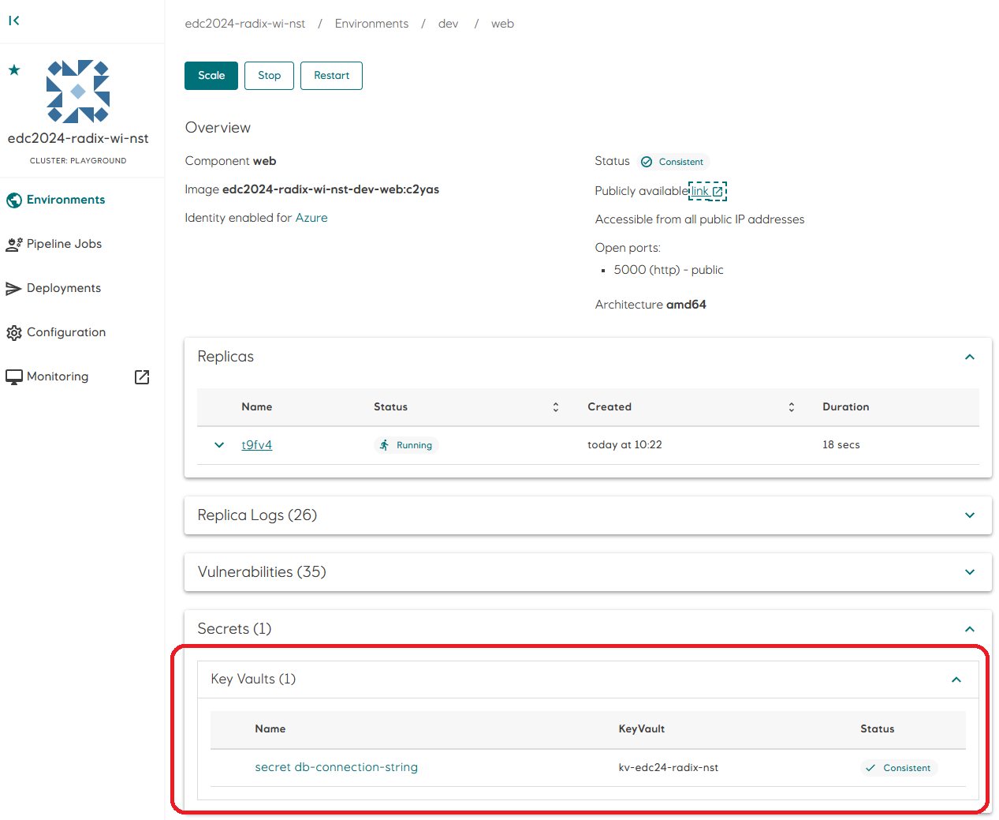
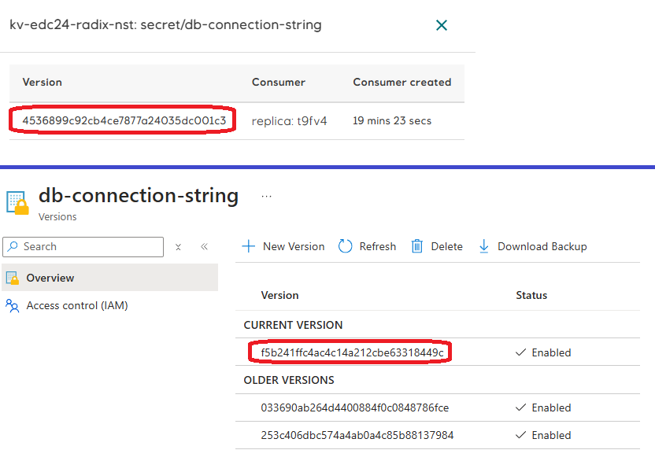

# Configure Workload Identity Azure Key Vault

You can configure Radix to read secrets, keys and certificates from Azure Key Vault and make them available as files and environment variables in your application. This feature supports workload identity authentication.

The following steps configures authentication to Azure Key Vault using workload identity. We will move the value for `DB_CONNECTION_STRING` from variables in radixconfig.yaml to a Azure Key Vault.

## 1. Create a Azure Key Vault to store the secret

We will now create a key vault to hold the secrets we will access from Radix. The script prints the name of the key vault to the terminal. We'll use the name later, so make a note of it.

```
az keyvault create --subscription d1775405-6d42-4fba-99ac-3cae223d9087 \
  --resource-group radix-workshop-24 \
  --location northeurope \
  --enable-rbac-authorization \
  --query name -otsv \
  --name kv-edc24-radix-$(az ad signed-in-user show -otsv --query mail | awk -F"@" '{print tolower($1)}')
```

We must then grant ourself permission to manage all data in the keyvault:

```
az role assignment create \
  --scope "/subscriptions/d1775405-6d42-4fba-99ac-3cae223d9087/resourceGroups/radix-workshop-24/providers/Microsoft.KeyVault/vaults/kv-edc24-radix-$(az ad signed-in-user show -otsv --query mail | awk -F"@" '{print tolower($1)}')" \
  --role "Key Vault Administrator" \
  --output none \
  --assignee-principal-type User \
  --assignee-object-id $(az ad signed-in-user show -otsv --query id)
```

## 2. Grant permissions to existing managed identity

The secrets in the key vault will be read by the managed identity that we previously created for the `web` component. We must grant this managed identity permission to read secrets:

```
principalId=$(az identity show --subscription d1775405-6d42-4fba-99ac-3cae223d9087 \
  --resource-group radix-workshop-24 \
  --name id-edc24-radix-workshop-$(az ad signed-in-user show -otsv --query mail | awk -F"@" '{print tolower($1)}') \
  --query principalId \
  -otsv) && \
az role assignment create \
  --scope "/subscriptions/d1775405-6d42-4fba-99ac-3cae223d9087/resourceGroups/radix-workshop-24/providers/Microsoft.KeyVault/vaults/kv-edc24-radix-$(az ad signed-in-user show -otsv --query mail | awk -F"@" '{print tolower($1)}')" \
  --output none \
  --role "Key Vault Secrets User" \
  --assignee-principal-type ServicePrincipal \
  --assignee-object-id $principalId
```

## 3. Create key vault secret `db-connection-string`

We will now register a key vault secret to hold the value of the `DB_CONNECTION_STRING` variable in radixconfig.yaml. Key vault secret names does not allow underscores, so we'll replace them with dashes and use `db-connection-string` as the secret name. We'll soon see how we can map the key vault secret name to an environment variable with a different name in radixconfig.yaml.

Replace `<Secret Value>` with the value of the `DB_CONNECTION_STRING` variable defined in the `variables` section in radixconfig.yaml

```
vaultname="kv-edc24-radix-$(az ad signed-in-user show -otsv --query mail | awk -F"@" '{print tolower($1)}')" && \
az keyvault secret set --subscription d1775405-6d42-4fba-99ac-3cae223d9087 \
  --vault-name $vaultname \
  --output none \
  --name db-connection-string \
  --value "<Secret Value>"
```

## 4. Configure key vault integration in radixconfig.yaml

We are now ready to configure our application to access the key vault.

Uncomment the `secretRefs` section in radixconfig.yaml and replace `<Key Vault Name>` with the name of the key vault created in step #1. 

Remove the `DB_CONNECTION_STRING` from the `variables` section.

The `web` component should now look something like this:
```yaml
  components:
    - name: web
      ...
      variables:
        ASPNETCORE_URLS: http://*:5000
      secretRefs:
        azureKeyVaults:
          - name: kv-edc24-radix-nst
            useAzureIdentity: true
            items:
              - name: db-connection-string
                envVar: DB_CONNECTION_STRING
```

Save radixconfig.yaml and commit and push to GitHub. Radix will now start a new `build-deploy` job to deploy the changes we just made. Wait for it to complete and then navigate to the `web` component in Radix Web Console. The `Secrets` > `Key Vaults` section should now have one entry `secret db-connection-string` with status `Consistent`.



NB: Replica environment variables mapped to key vault secrets are not automatically updated. You must restart the component for changes to take effect once the key vault is successfully synced to Radix. To verify if Radix has the correct version of the secret, click on the secret in Radix Web Console and compare the value in the `Version` column with the `CURRENT VERSION` in the key vault. Restart the component once the versions match.



---

[[Home]](../readme.md)  
[[Previous]](pipeline-configure-workload-identity.md)