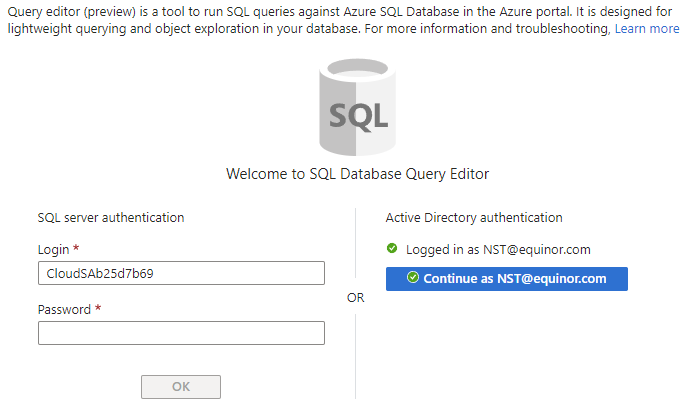
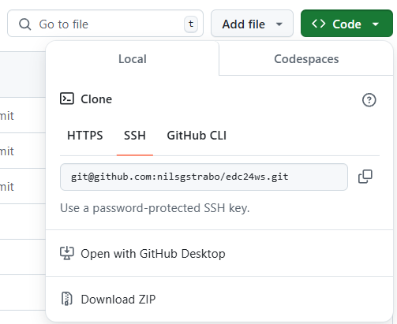
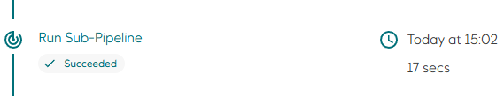

# Configure Workload Identity for sub-pipelines

[Sub-pipelines](https://www.radix.equinor.com/guides/sub-pipeline/) allows you to run custom code at the end of a Radix pipeline job, once per environment defined for the job. This means that the workload identity for each sub-pipeline execution is also environment specific, requiring federated credentials to be registered for each environment.

The following steps configures workload identity for sub-pipelines. This prepares the required infrastructure (managed identity, radixconfig.yaml and federated credentials) to allow the sub-pipeline to deploy schema changes to our `moviedb` database.

## 1. Create a managed identity in Azure:

- Run the following command in the terminal to create a managed identity to be used when running sub-pipelines for the `dev` environment:
  ```
  az identity create --subscription d1775405-6d42-4fba-99ac-3cae223d9087 \
  --resource-group radix-workshop-24 \
  --name id-edc24-radix-workshop-pipeline-dev-$(az ad signed-in-user show -otsv --query mail | awk -F"@" '{print tolower($1)}') \
  --query "[clientId,name]" -otsv
  ```
  The command will print the `clientId` and `name` of the managed identity, which we will use to configure workload identity for sub-pipelines.

## 2. Grant database permissions to the managed identity

The managed identity we just created will be used by the sub-pipeline to deploy the SQL scripts that we previously executed manually in the [Configure Azure SQL Database](configure-azure-sql.md) step. We must therefore grant permissions to the managed identity to manage objects in the database. In this workshop we will do it the "quick and dirty" way by adding it to the `db_owner` role. This does not follow the principle of least privilege, and in a real application you should identity what permissions are required, and only grant those.

   - Open the [radix-workshop-24](https://portal.azure.com/#@StatoilSRM.onmicrosoft.com/resource/subscriptions/d1775405-6d42-4fba-99ac-3cae223d9087/resourcegroups/radix-workshop-24/overview) resource group, find and open your SQL Server (you can type your user name in the `Filter` field), go to `SQL databases` and click on the `moviedb` database to open.
   - Click `Query editor (preview)` in the left menu, and then the blue `Continue as <your email>` button.  
   
   - Replace `<managed identity name>` in the following SQL script with the name printed in the previous step, and `Run` it. NB: Do **not** remove the square brackets (`[]`): 
   ```
   CREATE USER [<managed identity name>] FROM EXTERNAL PROVIDER

  ALTER ROLE db_owner ADD MEMBER [<managed identity name>]
   ```

## 3. Configure workload identity for sub-pipeline

- Open `radixconfig.yaml` and uncomment the `subPipeline` section in the `environments` section.  
- Replace `<clientId>` with value printed in first step.
- Replace `<insert server fqdn here>` for the `DB_SERVER_NAME` variable with the SQL server name. You can get the FQDN with the following script  
  ```
  az sql server show --subscription d1775405-6d42-4fba-99ac-3cae223d9087 \
  --resource-group radix-workshop-24 \
  --name sql-edc24-radix-workshop-$(az ad signed-in-user show -otsv --query mail | awk -F"@" '{print tolower($1)}') \
  --query fullyQualifiedDomainName \
  -otsv
  ```

- Replace `<insert ssh url to git repo here>` for the `GIT_REPO` variable with the Git SSH URL for your repo. You can find this value in your GitHub repo  

- The `subPipeline` section should now look something like this:
  ```yaml
  subPipeline:
    variables:
      DB_SERVER_NAME: sql-edc24-radix-workshop-nst.database.windows.net
      GIT_REPO: git@github.com:nilsgstrabo/edc24-radix-workshop.git
    identity:
      azure:
        clientId: 2f383bda-613b-409c-a71f-2e33231619a5
  ```
- Save the changes you made to `radixconfig.yaml`


## 4. Configure federated credentials for the managed identity

We must create a federated credential entry for each environment defined in radixconfig.yaml. A sub-pipeline execution is bound to a specific environment, and the environment name is part of the workload identity name: `subpipeline-<Environment Name>-sa`  
Our application has only one environment, `dev`, so the workload identity name becomes `subpipeline-dev-sa`

Replace the following placeholders in the command below:  
`<Cluster Issuer URL>`: https://northeurope.oic.prod-aks.azure.com/3aa4a235-b6e2-48d5-9195-7fcf05b459b0/2000308d-8631-43c6-8bf7-64caea92b89a/  
`<App Name>`: name of the application, as defined in `metadata.name` in radixconfig.yaml

  ```
  az identity federated-credential create --subscription d1775405-6d42-4fba-99ac-3cae223d9087 \
  --resource-group radix-workshop-24 \
  --output none \
  --issuer <Cluster Issuer URL> \
  --audiences api://AzureADTokenExchange \
  --subject system:serviceaccount:<App Name>-app:subpipeline-dev-sa \
  --identity-name id-edc24-radix-workshop-pipeline-dev-$(az ad signed-in-user show -otsv --query mail | awk -F"@" '{print tolower($1)}') \
  --name radix-workshop-fedcred-pipeline-dev
  ```

## 5. Configure sub-pipelines

Radix will look for sub-pipeline definitions in a directory named `tekton`. In this repo there is a directory named `_tekton` (starts with underscore). The two files in this directory defines the steps that will run as part of a Radix pipeline.

Rename the directory from `_tekton` to `tekton`.

## 6. Update SQL script

Open the `/sql/1-schema.sql` file and add the following to the end of the file

```
IF NOT EXISTS(SELECT 1 FROM sys.columns WHERE object_id=object_id('dbo.Movie') and name='StoryLine')
BEGIN
	PRINT 'Add column StoryLine to table dbo.Movie'
	ALTER TABLE dbo.Movie ADD StoryLine NVARCHAR(MAX)
END
```

This SQL statement will add a new column `StoryLine` to the `dbo.Movie` table. If everything is configured correctly, the column will be added to the table by the sub-pipeline.

## 7. Commit and push change to GitHub

Commit and push changes to trigger a new build-deploy job for your Radix application.

The last step should now be `Run Sub-Pipeline`  


You can click on `Run Sub-Pipeline` to drill down to individual steps to get status and logs.

---

[[Home]](../readme.md)  
[[Previous]](configure-page-storageaccount.md) [[Next]](keyvault-workload-identity.md)
