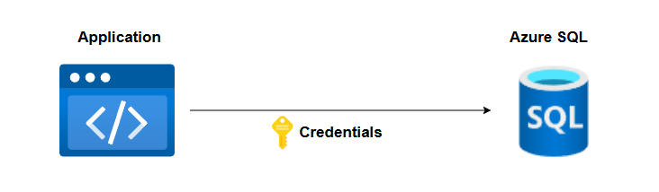

# Workload Identity in Radix

When an application needs to access data from protected Azure resources, such as Azure Key vault, Azure Storage Account or Azure SQL Database, it must provide credentials to authenticate and get access to the resource's data. Depending on the resource type, these credentials can be in the form of a username and password, a resource specific access key, or an access token in JWT format from an Azure Service Principal.



A Service Principal is an identity which represents a non-human user. In other words it is an identity intended to be used by applications/services, automation tools, etc., to access protected Azure resources.

To get an access token for a Service Principal, our application must send a HTTP POST request to the Microsoft Identity Provider's (IdP) [`/token`](https://learn.microsoft.com/en-us/entra/identity-platform/v2-oauth2-client-creds-grant-flow#get-a-token) endpoint: `https://login.microsoftonline.com/<tenant-id>/oauth2/v2.0/token`.  
The request must contain information about which Service Principal we want to acquire an access token for, the scope of the access token (the resource type we want to access, e.g. `graph.microsoft.com`, `database.windows.net`), and some sort of proof that our application is allowed to acquire an access token for this Service Principal. This proof can be one of the following:
- A client secret generated for the Service Principal, and shared with our application.
- A JWT created and signed with a certificate that our application owns.
- A OpenID Connect (OIDC) ID Token issued to our application by another Identity Provider, such as GitHub or Kubernetes, also known as federated credentials.


Example - Acquire an access token for accessing Azure SQL databases using `client_secret`:
```
POST https://login.microsoftonline.com/3aa4a235-b6e2-48d5-9195-7fcf05b459b0/oauth2/v2.0/token

client_id=d5f572de-9dc9-4154-a6c2-ffdc36979363
&scope=https%3A%2F%2Fdatabase.windows.net%2F.default
&client_secret=qWgdYAmab0YSkuL1qKv5bPX
&grant_type=client_credentials
```

The `access_token` field JSON response holds the JWT access token that we can use as credentials when accessing a Azure SQL database:
```json
{
	"token_type": "Bearer",
	"expires_in": 86399,
	"ext_expires_in": 86399,
	"access_token": "eyJ0eXAiOiJKV1QiLCJhbGciOiJSUzI1NiIsIng1dCI6IjNQYUs0RWZ5Qk5RdTNDdGpZc2EzWW1oUTVFMCIsImtpZCI6IjNQYUs0RWZ5Qk5RdTNDdGpZc2EzWW1oUTVFMCJ9.eyJhdWQiOiJodHRwczovL2RhdGFiYXNlLndpbmRvd3MubmV0IiwiaXNzIjoiaHR0cHM6Ly9zdHMud2luZG93cy5uZXQvM2FhNGEyMzUtYjZlMi00OGQ1LTkxOTUtN2ZjZjA1YjQ1OWIwLyIsImlhdCI6MTczMDcxNDkzMiwibmJmIjoxNzMwNzE0OTMyLCJleHAiOjE3MzA4MDE2MzIsImFpbyI6IkFTUUEyLzhZQUFBQXVuT0Iya3ZVOE5DeVJQa3ltS1FXb3VWeVBxV1gxdHVQcHJYTHB4SFJKTHM9IiwiYXBwaWQiOiI2ZWQ5ODJjMS01YWY0LTRmZTktOTkxYy01ZTk1YWEwNjVhMDciLCJhcHBpZGFjciI6IjIiLCJpZHAiOiJodHRwczovL3N0cy53aW5kb3dzLm5ldC8zYWE0YTIzNS1iNmUyLTQ4ZDUtOTE5NS03ZmNmMDViNDU5YjAvIiwiaWR0eXAiOiJhcHAiLCJvaWQiOiJkNWY1NzJkZS05ZGM5LTQxNTQtYTZjMi1mZmRjMzY5NzkzNjMiLCJyaCI6IjEuQVFJQU5hS2tPdUsyMVVpUmxYX1BCYlJac05NSEtRSWJEX2RJdXR3YnBxdXJiV1lDQUFBQ0FBLiIsInN1YiI6ImQ1ZjU3MmRlLTlkYzktNDE1NC1hNmMyLWZmZGMzNjk3OTM2MyIsInRpZCI6IjNhYTRhMjM1LWI2ZTItNDhkNS05MTk1LTdmY2YwNWI0NTliMCIsInV0aSI6IkIwXzNsMFljX1VpMGNsR3Y0WlkzQUEiLCJ2ZXIiOiIxLjAiLCJ4bXNfaWRyZWwiOiIxOCA3IiwieG1zX21pcmlkIjoiL3N1YnNjcmlwdGlvbnMvZDE3NzU0MDUtNmQ0Mi00ZmJhLTk5YWMtM2NhZTIyM2Q5MDg3L3Jlc291cmNlZ3JvdXBzL3JhZGl4LXdvcmtzaG9wLTI0L3Byb3ZpZGVycy9NaWNyb3NvZnQuTWFuYWdlZElkZW50aXR5L3VzZXJBc3NpZ25lZElkZW50aXRpZXMvaWQtZWRjMjQtcmFkaXgtd29ya3Nob3AtbnN0In0.hxYAydxokKdIFoT48sfhg9-TYgvnuagLIFsV1C-vH3mBJodyx6LpaUpw1pMFPB--5v7c2n6Bbina4t4NOpJB0IRS32RfCIYLNSKkhIFBIPXSPBK_FoAxqaoec2sZRktEAuInD9s92iXbrnUvJJI9PdR7P8t0_1D3dJ8sspQm2QM8Y3rqOoO8Jg1IqaoWHl5hZluKr0IC1FZKhKIDqEFmTZaebWBqQr7GeaVnlTtmdoqZvoLuVF43gromA3pE4mEwFh-BO74UIP6laMlfKmPx32jVklBPxz9oc2y_NiAKbme1SP82tmqLljXj5r_cjIPoYXCrh9CHgHWXve3S2-pP9w"
}
```

Using a shared `client_secret` in the `/token` request faces a few challenges:
- The `client_secret` must be stored somewhere our application can access it.
- Anyone who knows the secret can acquire access tokens for Azure resources.
- The secret has an expiry date, and failing to refresh and distribute the new secret to all consumers will most probably result in service disruption.

This is where Workload Identity and federated credentials come into play. If the platform that is hosting our application is capable of providing our running application with an OIDC ID Token that identifies it, we can use this token instead of a client_secret in the `/token` request to the Microsoft Identity Provider. These tokens are usually short lived (hours), they exist only inside the running application, they contain well defined fields to uniquely identify our application (`sub`, `iss`, `aud`), and they are digitally signed.


Example of ID token:
```json
{
    "alg": "RS256",
    "kid": "T1hwRPH8LNbVo2nswAHwDhVTt1Yz5YmGyNubWQdTbKk"
}.{
    "iss": "https://login.example-issur.com/",
    "aud": [
        "api://AzureADTokenExchange"
    ],
    "sub": "the-unique-name-of-the-identity",
    "exp": 1730883506,
    "iat": 1730879906,
    "nbf": 1730879906,
}.[Signature]
```

Our application can then pass the ID token as `client_assertion` in the request to the Microsoft IdP `/token` endpoint:
```
POST https://login.microsoftonline.com/3aa4a235-b6e2-48d5-9195-7fcf05b459b0/oauth2/v2.0/token

client_id=d5f572de-9dc9-4154-a6c2-ffdc36979363
&scope=https%3A%2F%2Fdatabase.windows.net%2F.default
&client_assertion=eyJhbGciOiJSUzI1NiIsIng1dCI6Imd4OHRHeXN5amNScUtqRlBuZDdSRnd2d1pJMCJ9.eyJ{a lot of characters here}M8U3bSUKKJDEg
&grant_type=client_credentials
```

Before we can use the ID Token, we must register a trust relationship, also known as [`federated credentials`](https://learn.microsoft.com/en-us/entra/identity-platform/v2-oauth2-client-creds-grant-flow#third-case-access-token-request-with-a-federated-credential), between the token issued by the external Identity Provider, and the Azure Service Principal, using the well-known fields `iss` (Issuer URL), `sub` (Subject identifier) and `aud` (Audience). This information must be provided to us by the hosting platform.


When Microsoft IdP receives the request with a `client_assertion`, it will decode the ID token, compare the `iss`, `aud` and `sub` fields in the token with the federated credentials registered for the Service Principal. If it finds a match it will validate the digital signature of the provided ID token by getting the public signing keys from the issuer's `/.well-known/openid-configuration` endpoint. The `exp` and `nbf` fields are of course also checked.  
If everything is found to be OK, an access token is provided in the response.

Radix runs on Kubernetes, and Kubernetes can act as an Identity Provider, and assign and inject ID Tokens into containers.  
When we configure the [`identity`](https://www.radix.equinor.com/radix-config#identity-2) section for a component or job in radixconfig.yaml, we tell Kubernetes to assign an identity and mount an ID Token into a file named `/var/run/secrets/azure/tokens/azure-identity-token` to the containers belonging to the component/job. The `sub` identifier for the ID Token follows the pattern`system:serviceaccount:<app-name>-<env-name>:<component-name>-sa`

We can also configure [`identity`](https://www.radix.equinor.com/radix-config#identity-1) for sub-pipelines. The only difference from components and jobs is the name of the `sub` identifier. The naming pattern is `system:serviceaccount:<app-name>-app:subpipeline-<env-name>-sa`. A sub-pipeline is executed for a specific environment, so the identity must contain the environment name.

Example of projected ID Token for a component/job, decoded using [https://jwt.ms](https://jwt.ms):


In addition to the mounted ID Token, Radix also adds four environment variables to your container that contains information that is useful when calling the Microsoft IdP `/token` endpoint:

- `AZURE_AUTHORITY_HOST`: Microsoft IdP base URL - `https://login.microsoftonline.com/`
- `AZURE_TENANT_ID`: The Azure Tenant ID for Equinor - `3aa4a235-b6e2-48d5-9195-7fcf05b459b0`
- `AZURE_CLIENT_ID`: The Application/Client ID for the Service Principal, as defined in the `identity` section in radixconfig.yaml
- `AZURE_FEDERATED_TOKEN_FILE`: Full path and name of the file containing the ID Token issued by Kubernetes IdP - `/var/run/secrets/azure/tokens/azure-identity-token`

By using these variables, our application can make raw HTTP requests to the Microsoft IdP `/token` endpoint to receive an access token for a Service Principal that our application can use to access Azure resources.

```shell
curl ${AZURE_AUTHORITY_HOST}${AZURE_TENANT_ID}/oauth2/v2.0/token \
  -X POST \
  -d "scope=https%3A%2F%2Fgraph.microsoft.com%2F.default
    &client_id=${AZURE_CLIENT_ID}
    &client_assertion_type=urn%3Aietf%3Aparams%3Aoauth%3Aclient-assertion-type%3Ajwt-bearer
    &client_assertion=$(cat $AZURE_FEDERATED_TOKEN_FILE)
    &grant_type=client_credentials"
```

Fortunately, in most cases we do not need to handle the raw HTTP requests ourselves. Microsoft has developed libraries that does the heavy lifting for us, so we can focus on the tasks that matters. These libraries are available for languages like C#, Python, Java, Go, Javascript and more.

- The [Azure Identity SDK](https://learn.microsoft.com/nb-no/azure/aks/workload-identity-overview?tabs=dotnet#azure-identity-client-libraries) has native support for Workload Identity by using the `WorkloadIdentityCredential` provider. This provider is also included in the `DefaultAzureCredential` provider.
- The [Azure SDK](https://azure.microsoft.com/en-us/downloads/) works hand-in-hand with [Azure Identity SDK](https://learn.microsoft.com/nb-no/azure/aks/workload-identity-overview?tabs=dotnet#azure-identity-client-libraries)
  ```csharp
  var client = new SecretClient(new Uri(keyVaultUrl), new WorkloadIdentityCredential());
  KeyVaultSecret secret = await client.GetSecretAsync(secretName);
  ```
- Database drivers: some drivers, like the ADO.NET SQL Server driver, has [native support](https://learn.microsoft.com/en-us/sql/connect/ado-net/sql/azure-active-directory-authentication?view=sql-server-ver16#setting-azure-active-directory-authentication) for Workload Identity.

---

References:
- [Application and Service Principal objects in Microsoft Entra ID](https://learn.microsoft.com/en-us/entra/identity-platform/app-objects-and-service-principals?tabs=browser)
- [Microsoft Identity Platform and the OAuth 2.0 client credentials flow](https://learn.microsoft.com/en-us/entra/identity-platform/v2-oauth2-client-creds-grant-flow)
- [Use Microsoft Entra Workload ID with Azure Kubernetes Service (AKS)](https://learn.microsoft.com/en-us/azure/aks/workload-identity-overview?tabs=dotnet)